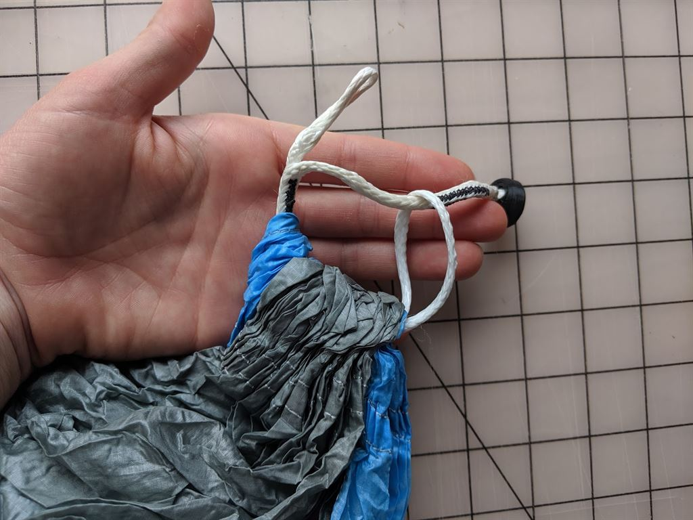
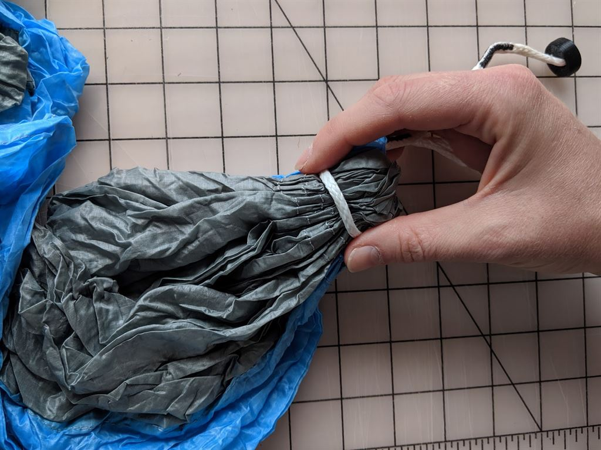

# Hammock Button Link Replacement Guide

Please follow this guide to replace damaged or worn out Button Links or simply readajust your improperly connected Button Link.

Remove the old Button Link by pulling the white spectra cord that is looped around the gathered hammock fabric and undoing the larks head knot. Pull the Button Link from the channel of the hammock fabric.

Feed the new Button Link through the same channel. It does not matter which direction the Button Link goes through.

Create a new larks head knot by feeding the button at one end through the large loop at the other end.

With one hand, pull the gathered hammock fabric tight so that no excess fabric is tied with the spectra cord.

With the other hand, slip the loop end of the Button Link around the gathered hammock fabric, making sure the cord is not in contact with itself.

Now, pull the button end of the Button Link so that the larks head knot tightens around the hammock fabric. The knot will be more secure when you have put your weight in the hammock.

Your spectra cord should NOT be contacting itself. If your cord is not wrapped around the hammock fabric, the stitching of the fabric will wear out more quickly.

Please be sure your Button Link is properly connected before each use.

Happy hanging!
